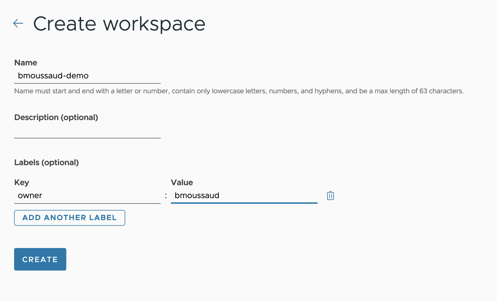
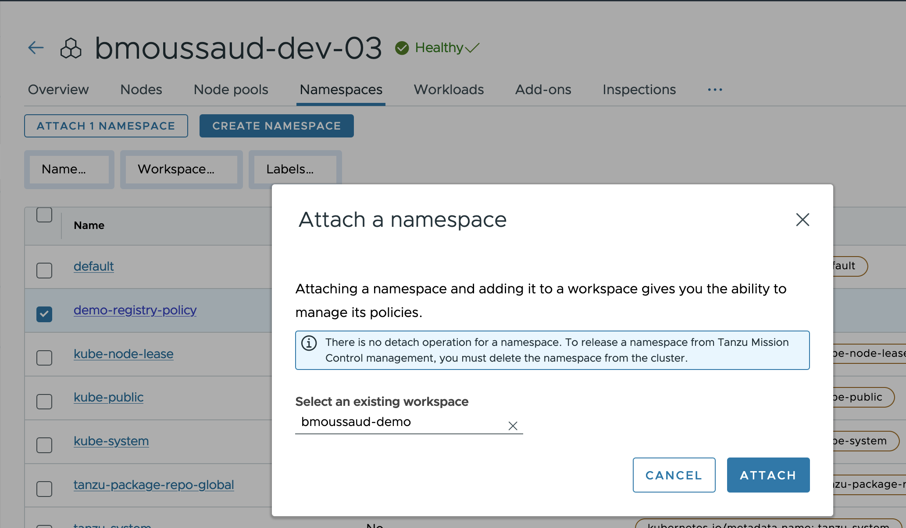
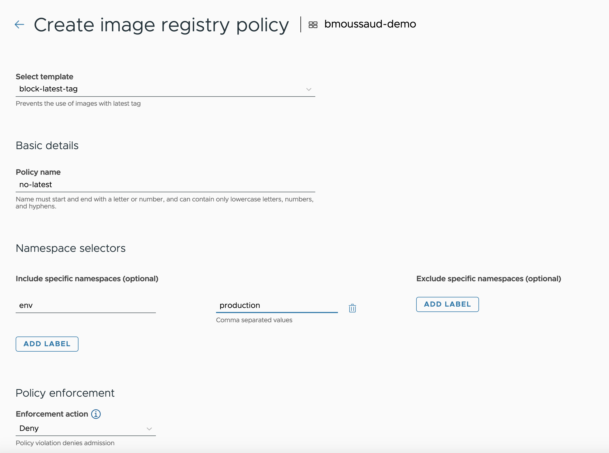
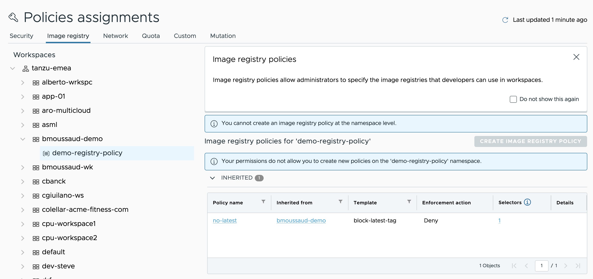
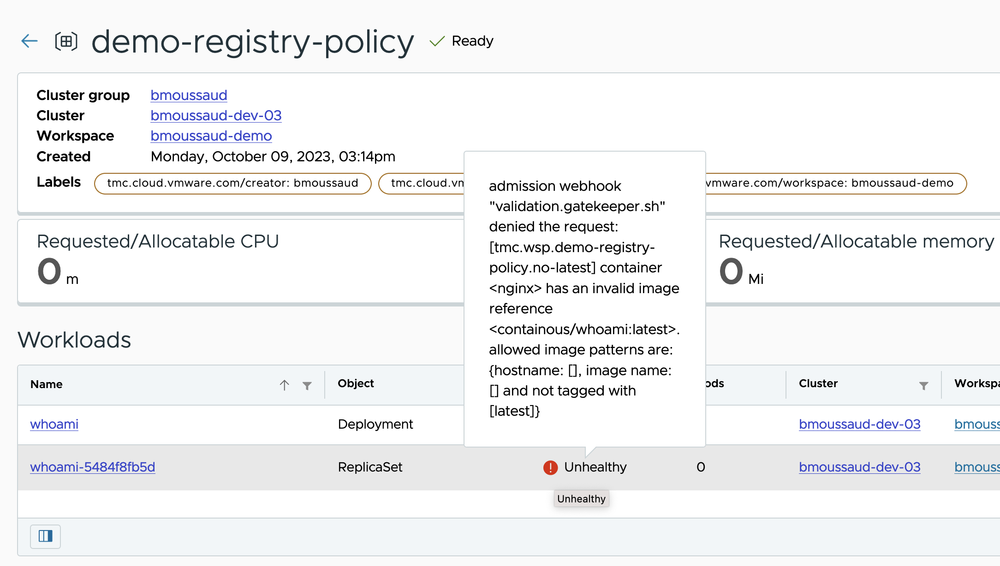

Demo Tanzu Mission Control registry policies

# Purpose

Deploy the latest version`who-ami` application from the docker hub. Configure Tanzu Mission Control to set 2 policies

1. Forbidden the latest tag
1. Allow only deployment from a customer local registry.

# Scenario #1

1. In the K8S cluster, Deploy The app

```
kubectl apply -f demo-registry-policies.yaml
```

2. In the K8S cluster, Check the application is up and running

```
kubectl get deployments whoami -n demo-registry-policy
NAME     READY   UP-TO-DATE   AVAILABLE   AGE
whoami   2/2     2            2           6s
```

3. In TMC, create the `bmoussaud-demo` workspace



3. In TMC, attach the `demo-registry-policy` namespace to  the `bmoussaud-demo` workspace



4. In TMC, create a new registry policy that applys only on the namespace having a `env=production` label.



BTW the created namespace has these labels

````
➜ kubectl get ns demo-registry-policy -o yaml | yq .metadata.labels
app: demo
env: production
kubernetes.io/metadata.name: demo-registry-policy
owner: bmoussaud
tmc.cloud.vmware.com/crd-type: tmc-managed
tmc.cloud.vmware.com/creator: bmoussaud
tmc.cloud.vmware.com/managed: "true"
tmc.cloud.vmware.com/workspace: bmoussaud-demo
```````



So the current status is our `who-ami` application is up & running

```
➜ kubectl tree deployments whoami -n demo-registry-policy
NAMESPACE             NAME                             READY  REASON  AGE
demo-registry-policy  Deployment/whoami                -              25m
demo-registry-policy  └─ReplicaSet/whoami-5484f8fb5d   -              25m
demo-registry-policy    ├─Pod/whoami-5484f8fb5d-z742c  True           25m
demo-registry-policy    └─Pod/whoami-5484f8fb5d-zn7td  True           25m
```

5. Delete the running pods and check the result

```
➜ kubectl delete pods -n demo-registry-policy --all
pod "whoami-5484f8fb5d-z742c" deleted
pod "whoami-5484f8fb5d-zn7td" deleted

➜ kubectl tree deployments whoami -n demo-registry-policy
NAMESPACE             NAME                            READY  REASON  AGE
demo-registry-policy  Deployment/whoami               -              28m
demo-registry-policy  └─ReplicaSet/whoami-5484f8fb5d  -              28m
```

The Replication Set does not owe the associated pods

```
❯ kubectl get deployments whoami -n demo-registry-policy
NAME     READY   UP-TO-DATE   AVAILABLE   AGE
whoami   0/2     0            0           29m

➜ kubectl get ReplicaSet -n demo-registry-policy
NAME                DESIRED   CURRENT   READY   AGE
whoami-5484f8fb5d   2         0         0       30m

➜ kubectl describe ReplicaSet -n demo-registry-policy
Name:           whoami-5484f8fb5d
Namespace:      demo-registry-policy
Selector:       app=hello,pod-template-hash=5484f8fb5d
Labels:         app=hello
                pod-template-hash=5484f8fb5d
                tier=frontend
Annotations:    deployment.kubernetes.io/desired-replicas: 2
                deployment.kubernetes.io/max-replicas: 3
                deployment.kubernetes.io/revision: 1
Controlled By:  Deployment/whoami
Replicas:       0 current / 2 desired
Pods Status:    0 Running / 0 Waiting / 0 Succeeded / 0 Failed
Pod Template:
  Labels:  app=hello
           pod-template-hash=5484f8fb5d
           tier=frontend
  Containers:
   nginx:
    Image:        containous/whoami:latest
    Port:         <none>
    Host Port:    <none>
    Environment:  <none>
    Mounts:       <none>
  Volumes:        <none>
Conditions:
  Type             Status  Reason
  ----             ------  ------
  ReplicaFailure   True    FailedCreate
Events:
  Type     Reason            Age                   From                   Message
  ----     ------            ----                  ----                   -------
  Normal   SuccessfulCreate  30m                   replicaset-controller  Created pod: whoami-5484f8fb5d-zn7td
  Normal   SuccessfulCreate  30m                   replicaset-controller  Created pod: whoami-5484f8fb5d-z742c
  Warning  FailedCreate      36s (x16 over 2m41s)  replicaset-controller  Error creating: admission webhook "validation.gatekeeper.sh" denied the request: [tmc.wsp.demo-registry-policy.no-latest] container <nginx> has an invalid image reference <containous/whoami:latest>. allowed image patterns are: {hostname: [], image name: [] and not tagged with [latest]}
```

The last message tells us why there is no pod running in the namespace

in Tanzu Mission Control, the ui give the same message



6. Modify the environment. The policy applys only if the current namespace has the `env=production` label. So let's change this to another value (for dev) 

```
➜ kubectl label ns demo-registry-policy --overwrite env=dev
namespace/demo-registry-policy labeled
➜ k delete -n demo-registry-policy rs whoami-5484f8fb5d
replicaset.apps "whoami-5484f8fb5d" deleted
➜ kubectl get pods -w -n demo-registry-policy
NAME                      READY   STATUS    RESTARTS   AGE
whoami-5484f8fb5d-pdcmh   0/1     Pending   0          0s
whoami-5484f8fb5d-pdcmh   0/1     Pending   0          0s
whoami-5484f8fb5d-cfq89   0/1     Pending   0          0s
whoami-5484f8fb5d-cfq89   0/1     Pending   0          0s
whoami-5484f8fb5d-pdcmh   0/1     ContainerCreating   0          0s
whoami-5484f8fb5d-cfq89   0/1     ContainerCreating   0          0s
whoami-5484f8fb5d-pdcmh   1/1     Running             0          3s
whoami-5484f8fb5d-cfq89   1/1     Running             0          5s
```

As soon as the replication set is recreate by the deployment, the `no-latest` policy does not apply anymore and the pods can be scheduled.


