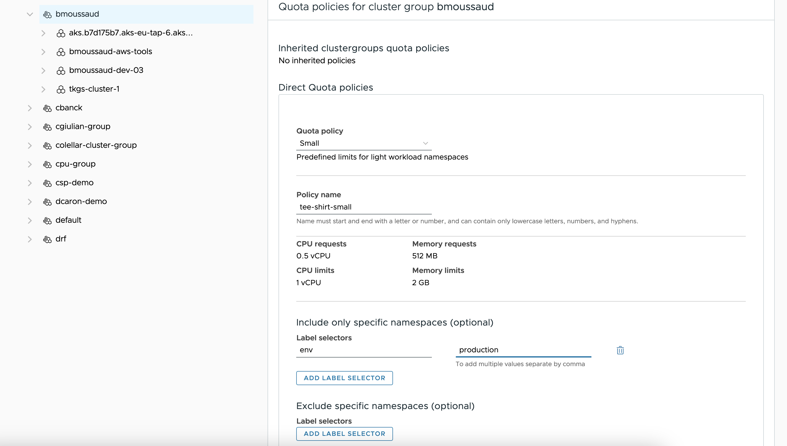

Demo Tanzu Mission Control quota policies

# Purpose

Deploy the latest version`who-ami` application from the docker hub. Configure Tanzu Mission Control to set 2 policies

1. Forbidden the latest tag
1. Allow only deployment from a customer local registry.

# Scenario #1 Small Quota

1. In the K8S cluster, Deploy The app

```
kubectl apply -f demo-quota-policies.yaml
```

4. In TMC, create a `tee-shirt-small`quota policy that applys only on the namespace having a `env=production` label associated to a cluster group.



BTW the created namespace has these labels

```
➜ kubectl get ns demo-registry-policy -o yaml | yq .metadata.labels
app: demo
env: production
kubernetes.io/metadata.name: demo-quota-policy
owner: bmoussaud
```

```
➜ kubectl get deployments.apps -n demo-quota-policies                                                                                                                          
NAME     READY   UP-TO-DATE   AVAILABLE   AGE
whoami   0/2     0            0           16s
```

```
➜ kubectl get deployments.apps -n demo-quota-policies -o yaml whoami | yq .status.conditions                                                                                   
- lastTransitionTime: "2023-10-10T13:15:06Z"
  lastUpdateTime: "2023-10-10T13:15:06Z"
  message: Created new replica set "whoami-5c774c77f7"
  reason: NewReplicaSetCreated
  status: "True"
  type: Progressing
- lastTransitionTime: "2023-10-10T13:15:06Z"
  lastUpdateTime: "2023-10-10T13:15:06Z"
  message: Deployment does not have minimum availability.
  reason: MinimumReplicasUnavailable
  status: "False"
  type: Available
- lastTransitionTime: "2023-10-10T13:15:06Z"
  lastUpdateTime: "2023-10-10T13:15:06Z"
  message: 'pods "whoami-5c774c77f7-smmcp" is forbidden: failed quota: tmc.cgp.tee-shirt-small: must specify limits.memory for: nginx; requests.memory for: nginx'
  reason: FailedCreate
  status: "True"
  type: ReplicaFailure
```
