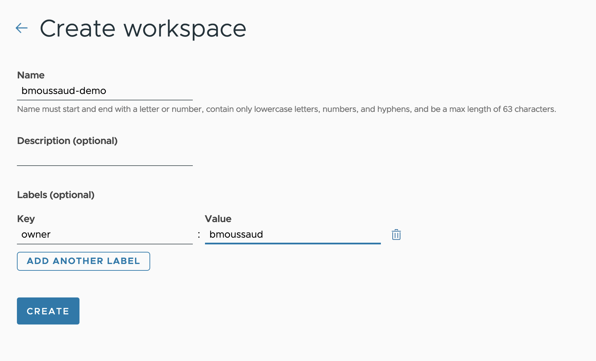
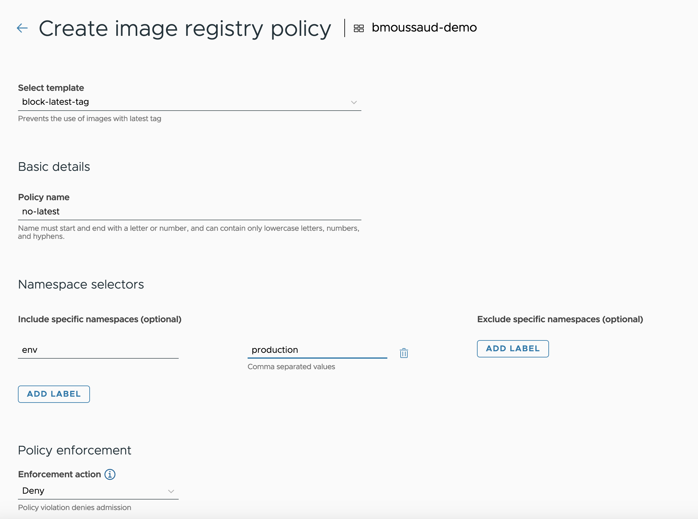

# Demo Tanzu Mission Control registry policies

## Purpose

Deploy the latest version`who-ami` application from the docker hub. Configure Tanzu Mission Control to set 2 policies

1. Forbidden the latest tag
1. Allow only deployment from a customer local registry.

## Scenario #1 No-Latest

1. In the K8S cluster, Deploy The app

```
kubectl apply -f demo-registry-policies.yaml
```

2. In the K8S cluster, Check the application is up and running

```
kubectl get deployments whoami -n demo-registry-policy
NAME     READY   UP-TO-DATE   AVAILABLE   AGE
whoami   2/2     2            2           6s
```

3. In TMC, create the `bmoussaud-demo` workspace



3. In TMC, attach the `demo-registry-policy` namespace to  the `bmoussaud-demo` workspace


4. In TMC, create a new registry policy that applys only on the namespace having a `env=production` label.



BTW the created namespace has these labels

````
➜ kubectl get ns demo-registry-policy -o yaml | yq .metadata.labels
app: demo
env: production
kubernetes.io/metadata.name: demo-registry-policy
owner: bmoussaud
...
```````


So the current status is our `who-ami` application is up & running

```
➜ kubectl tree deployments whoami -n demo-registry-policy
NAMESPACE             NAME                             READY  REASON  AGE
demo-registry-policy  Deployment/whoami                -              25m
demo-registry-policy  └─ReplicaSet/whoami-5484f8fb5d   -              25m
demo-registry-policy    ├─Pod/whoami-5484f8fb5d-z742c  True           25m
demo-registry-policy    └─Pod/whoami-5484f8fb5d-zn7td  True           25m
```

5. Delete the running pods and check the result

```
➜ kubectl delete pods -n demo-registry-policy --all
pod "whoami-5484f8fb5d-z742c" deleted
pod "whoami-5484f8fb5d-zn7td" deleted

➜ kubectl tree deployments whoami -n demo-registry-policy
NAMESPACE             NAME                            READY  REASON  AGE
demo-registry-policy  Deployment/whoami               -              28m
demo-registry-policy  └─ReplicaSet/whoami-5484f8fb5d  -              28m
```

The Replication Set does not owe the associated pods

```
❯ kubectl get deployments whoami -n demo-registry-policy
NAME     READY   UP-TO-DATE   AVAILABLE   AGE
whoami   0/2     0            0           29m

➜ kubectl get ReplicaSet -n demo-registry-policy
NAME                DESIRED   CURRENT   READY   AGE
whoami-5484f8fb5d   2         0         0       30m

➜ kubectl describe ReplicaSet -n demo-registry-policy
Name:           whoami-5484f8fb5d
Namespace:      demo-registry-policy
Selector:       app=hello,pod-template-hash=5484f8fb5d
Labels:         app=hello
                pod-template-hash=5484f8fb5d
                tier=frontend
....
Conditions:
  Type             Status  Reason
  ----             ------  ------
  ReplicaFailure   True    FailedCreate
Events:
  Type     Reason            Age                   From                   Message
  ----     ------            ----                  ----                   -------
  Normal   SuccessfulCreate  30m                   replicaset-controller  Created pod: whoami-5484f8fb5d-zn7td
  Normal   SuccessfulCreate  30m                   replicaset-controller  Created pod: whoami-5484f8fb5d-z742c
  Warning  FailedCreate      36s (x16 over 2m41s)  replicaset-controller  Error creating: admission webhook "validation.gatekeeper.sh" denied the request: [tmc.wsp.demo-registry-policy.no-latest] container <nginx> has an invalid image reference <containous/whoami:latest>. allowed image patterns are: {hostname: [], image name: [] and not tagged with [latest]}
```

The last message tells us why there is no pod running in the namespace

in Tanzu Mission Control, the ui provides the same message


6. Modify the environment. The policy applys only if the current namespace has the `env=production` label. So let's change this to another value (for dev) 

```
➜ kubectl label ns demo-registry-policy --overwrite env=dev
namespace/demo-registry-policy labeled
➜ k delete -n demo-registry-policy rs whoami-5484f8fb5d
replicaset.apps "whoami-5484f8fb5d" deleted
➜ kubectl get pods -w -n demo-registry-policy
NAME                      READY   STATUS    RESTARTS   AGE
whoami-5484f8fb5d-pdcmh   0/1     Pending   0          0s
whoami-5484f8fb5d-pdcmh   0/1     Pending   0          0s
whoami-5484f8fb5d-cfq89   0/1     Pending   0          0s
whoami-5484f8fb5d-cfq89   0/1     Pending   0          0s
whoami-5484f8fb5d-pdcmh   0/1     ContainerCreating   0          0s
whoami-5484f8fb5d-cfq89   0/1     ContainerCreating   0          0s
whoami-5484f8fb5d-pdcmh   1/1     Running             0          3s
whoami-5484f8fb5d-cfq89   1/1     Running             0          5s
```

As soon as the replication set is deleted, the K8S scheduler recreates it the deployment, the `no-latest` policy does not apply anymore and the pods can be scheduled.


7. Let's set a version. The image has now a version, `containous/whoami:v1.5.0`, even if we set `env=production` label, as the image has a version everything is ok
```
❯ kubectl label ns demo-registry-policy --overwrite env=production
namespace/demo-registry-policy labeled

❯ kubectl patch deployment whoami -n demo-registry-policy  -p \
  '{"spec":{"template":{"spec":{"containers":[{"name":"nginx","image":"containous/whoami:v1.5.0"}]}}}}'
deployment.apps/whoami patched

❯ kubectl get pods -w -n demo-registry-policy
NAME                      READY   STATUS    RESTARTS   AGE
whoami-7bc56dcdcc-85zr5   1/1     Running   0          38s
whoami-7bc56dcdcc-xtmct   1/1     Running   0          35s
```


## Scenario #2

1. Create a new registry policy, kind custom, to enforces images to match at least one combination of hostname, image name, along with optional tag or digest specified by rules

In the definition below we 


2. Delete the replication set to trigger the policy

```
❯ kubectl delete -n demo-registry-policy rs --all
replicaset.apps "whoami-5484f8fb5d" deleted

❯ kubectl get pods -w -n demo-registry-policy
NAME                      READY   STATUS    RESTARTS   AGE
whoami-7bc56dcdcc-85zr5   1/1     Running   0          72m
whoami-7bc56dcdcc-xtmct   1/1     Running   0          72m
whoami-7bc56dcdcc-85zr5   1/1     Terminating   0          73m
whoami-7bc56dcdcc-xtmct   1/1     Terminating   0          73m
whoami-7bc56dcdcc-xtmct   0/1     Terminating   0          73m
whoami-7bc56dcdcc-xtmct   0/1     Terminating   0          73m
whoami-7bc56dcdcc-xtmct   0/1     Terminating   0          73m
whoami-7bc56dcdcc-85zr5   0/1     Terminating   0          73m
whoami-7bc56dcdcc-85zr5   0/1     Terminating   0          73m
whoami-7bc56dcdcc-85zr5   0/1     Terminating   0          73m
```

The pods are deleted but not recreated.

```
➜ k get rs -n demo-registry-policy   -w
NAME                DESIRED   CURRENT   READY   AGE
whoami-7bc56dcdcc   2         0         0       74s


❯ k describe rs -n demo-registry-policy   whoami-7bc56dcdcc
Name:           whoami-7bc56dcdcc
Namespace:      demo-registry-policy
....
Conditions:
  Type             Status  Reason
  ----             ------  ------
  ReplicaFailure   True    FailedCreate
Events:
  Type     Reason        Age                 From                   Message
  ----     ------        ----                ----                   -------
  Warning  FailedCreate  17s (x15 over 99s)  replicaset-controller  Error creating: admission webhook "validation.gatekeeper.sh" denied the request: [tmc.wsp.demo-registry-policy.only-image-from-my-local-registry] container <nginx> has an invalid image reference <containous/whoami:v1.5.0>. allowed image patterns are: {hostname: [harborpoc.h2o-4-18157.h2o.vmware.com], image name: []}
```

The event tells the TMC policy allows the images from the  `harborpoc.h2o-4-18157.h2o.vmware.com` host only.

Tanzu Mission Control UI displays the Policy Insights


